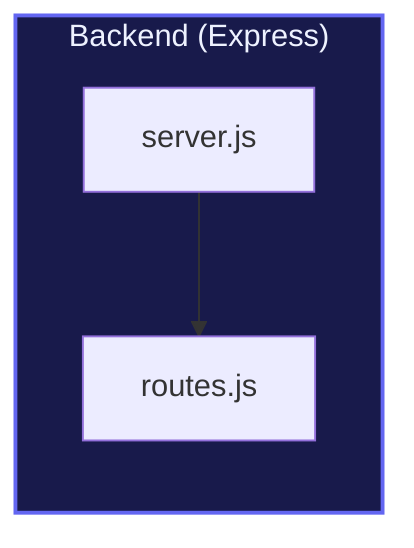
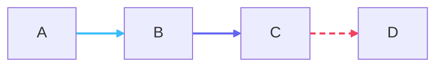
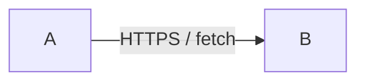
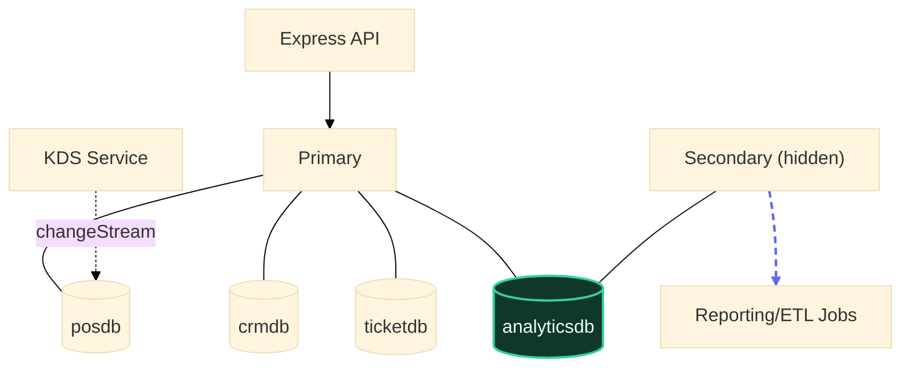
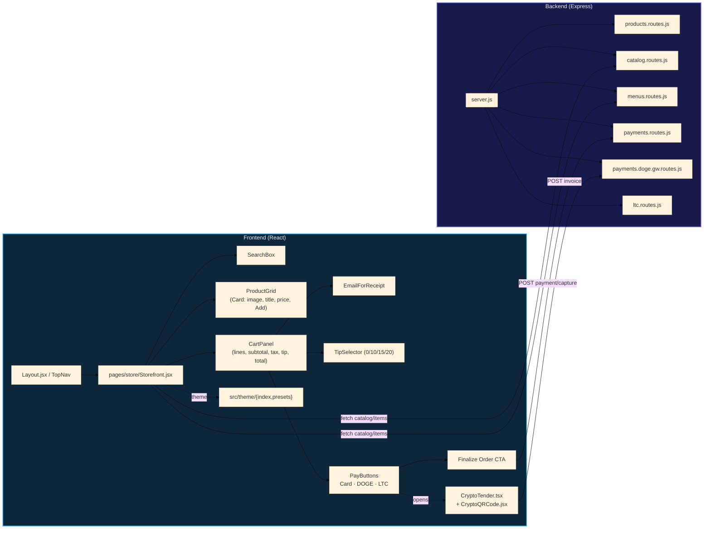

# RenderWOW — Mermaid-powered diagramming with opinionated polish

RenderWOW is a tiny app (Electron or plain browser) that wraps **Mermaid** with:
- A crisp dark theme and **tinted subgraph “comment boxes”**.
- Readable, high-contrast **edge labels** and **brighter edges**.
- A floating Monaco editor (collapse/expand with `Ctrl+\`) and live render (`Ctrl/Cmd+S`).
- Pan/zoom, fit-to-screen, export **SVG** and **high-DPI PNG** (with inlined styles).
- A few **writing conventions (“RenderWOW style”)** to keep complex diagrams consistent.

> ⚠️ We don’t change Mermaid’s grammar. Everything is standard Mermaid v10+. The
> “RenderWOW style” below is a set of copy-pasteable patterns and color recipes that
> make big system maps readable (edges by index, tinted clusters, safe labels, etc.).

<br>

## Contents
- [Install & Run](#install--run)
- [Project Layout](#project-layout)
- [Controls](#controls)
- [Authoring — The RenderWOW Style](#authoring--the-renderwow-style)
  - [1) The `init` block](#1-the-init-block)
  - [2) Safe labels & shapes](#2-safe-labels--shapes)
  - [3) Tinted subgraphs (clusters)](#3-tinted-subgraphs-clusters)
  - [4) Colored edges by **index**](#4-colored-edges-by-index)
  - [5) Curves, dashed lines & emphasis](#5-curves-dashed-lines--emphasis)
  - [6) Link-label “chips”](#6-link-label-chips)
  - [7) Node & cluster styling cheat sheet](#7-node--cluster-styling-cheat-sheet)
- [Examples](#examples)
- [Exporting (SVG & PNG) — exactly sized, non-blurry](#exporting-svg--png--exactly-sized-nonblurry)
- [Troubleshooting](#troubleshooting)
- [FAQ](#faq)

---

## Install & Run

```bash
# clone your repo, then:
npm install

# dev (Electron)
npm run dev

# build production package
npm run build
```

Requirements: **Node.js 18+**. Works on macOS / Windows / Linux.

---

## Project Layout

```text
public/
  index.html              # app shell (loads vendors, styles, main.js)
  assets/
    main.js               # UI controls, pan/zoom, export, editor toggle
    pipeline.js           # preProcess (sanitize) + postProcess (grid, padding)
    styles.css            # layout + main Mermaid polish (active theme)
    theme-wow.css         # optional reference theme
  vendor/
    mermaid/mermaid.min.js
    lz-string/lz-string.min.js
    monaco/**             # Monaco loader + workers (local/offline)

electron/
  main.js                 # Electron main process (CSP, deep-link, save dialogs)
  preload.js              # Exposes saveSvg/savePng to the renderer
  package.json
```

---

## Controls

| Action | How |
|---|---|
| Render | **Ctrl/Cmd + S** (or the **Render** button) |
| Toggle editor | **Ctrl + \\\\** (or “Hide/Show Editor”) |
| Zoom | `+` / `-` in toolbar, or **Ctrl/Cmd + Mousewheel** |
| Pan | Click-drag on the canvas |
| Fit to screen | **Fit** |
| Reset pan/zoom | **Reset** |
| Export | **Export SVG** / **Export PNG** |
| Share (dev) | **Copy Share URL** (packs code + theme in a URL fragment) |

---

## Authoring — The RenderWOW Style

RenderWOW diagrams are just **Mermaid**, plus a handful of conventions that make
large maps readable and skimmable.

### 1) The `init` block

Always start diagrams with an explicit init header so your colors/curves are stable:

```mermaid
%%{init:{
  "theme":"base",
  "flowchart":{"curve":"basis","useMaxWidth":true},
  "themeVariables":{
    "fontFamily":"Inter, ui-sans-serif, system-ui, -apple-system, Segoe UI, Roboto, Arial, sans-serif",
    "lineColor":"#9be0ff",
    "arrowheadColor":"#9be0ff"
  }
}}%%
```

Notes:
- **Don’t** use `linkStyle default` (it’s unsupported in some Mermaid builds). Use
  `themeVariables.lineColor/arrowheadColor` for the baseline, then color specific
  edges by **index** (below).
- Curves: `basis` gives smooth paths on big canvases; try `linear` or `monotoneX`
  if you need straighter lines.

### 2) Safe labels & shapes

- **Always quote labels** that contain spaces/punctuation: `A["Express API"]`.
- Newlines inside a label: use `<br/>` (HTML) not `\n`.
- Prefer simple **node IDs**: letters/digits/underscores (`A1`, `server_js`)—avoid
  dots or slashes in IDs and keep punctuation **inside the quotes** only.
- Two-way links are TWO edges (Mermaid has no “double arrow”): `A-->B` **and** `B-->A`.

Common flowchart shapes (examples):
```mermaid
flowchart LR
  A["Rectangle"] --> B("Round")
  B --> C{{"Decision"}}
  C --> D[/"Database-ish"/]
  D --> E[[ "Subroutine" ]]
  E --> F(("Circle"))
```

### 3) Tinted subgraphs (clusters)

Use subgraphs to group areas and tint with `style` lines (hex colors only).



Tint presets we use a lot:

| Name | fill | stroke |
|---|---|---|
| sky | `#0f273a` | `#38bdf8` |
| indigo | `#181a4b` | `#6366f1` |
| purple | `#2a0f3a` | `#a855f7` |
| emerald | `#10372b` | `#34d399` |
| orange | `#3a1f0f` | `#fb923c` |

> You can also attach classes to subgraphs (`subgraph X["Title"]:::g-emerald`) and add
> CSS rules for `.cluster.g-emerald`, but `style` lines are simplest and export-friendly.

### 4) Colored edges by **index**

Mermaid assigns an index to **each edge in the order it’s written** (0-based). You
can target individual edges or ranges for color/width/dash patterns.



**Tips**
- Keep a “**Edge index map**” comment at the bottom of your diagram. Every time you
  add/remove an edge, update the index list and your `linkStyle …` lines.
- `color:` controls the **label text** color that floats on the edge.
- Supported style props on links: `stroke`, `stroke-width`, `stroke-dasharray`,
  and `color` (for the label).

### 5) Curves, dashed lines & emphasis

- Use `-.->` for “soft/optional” or background flows; add `stroke-dasharray:6 4` for
  visible dashes.
- Prefer `basis` curves for spaghetti-ish graphs; switch to `linear` for straight wiring.
- Make “hot paths” slightly thicker (`stroke-width:2.2px`+).

### 6) Link-label “chips”

RenderWOW’s CSS gives edge labels a readable chip on dark backgrounds. You don’t
need to do anything special; when you add `|label|` it will render as a pill with
contrast. Example:



### 7) Node & cluster styling cheat sheet

- `style N fill:#0f1b34,stroke:#1e335f,stroke-width:1.4px,color:#eaf2ff,rx:10,ry:10`
- Cluster (subgraph) title gains the cluster’s text color (`color:`). For more contrast,
  prefer `color:#eaf6ff` on dark fills.
- Avoid `rgba()` in Mermaid `style` lines for portability—use hex.

---

## Examples

### A) API + Middleware + Routers (with colored edges)
```mermaid
%%{init:{
  "theme":"base",
  "flowchart":{"curve":"basis","useMaxWidth":true},
  "themeVariables":{"lineColor":"#9be0ff","arrowheadColor":"#9be0ff"}
}}%%
flowchart TD
  A["Clerks & Admins<br/>(Browser :5173)"] -->|"HTTPS / fetch"| B["React SPA<br/>Vite + React Router + Axios"]
  B -->|"/api/* with JWT<br/>+ refresh cookie"| C["Express API<br/>(server.js)"]

  subgraph M["Middleware"]
    M1["Helmet CSP"] --> M2["CORS allowlist"] --> M3["Compression"] --> M4["Request ID"]
    M4 --> M5["Rate limiter"] --> M6["Cookie parser"] --> M7["Auth/JWT guard"]
  end
  C --> M

  subgraph R["Routers (/api/*)"]
    R1["/auth/"] R2["/products"] R3["/orders/"]
  end
  C --> R

  %% Tints
  style M fill:#10372b,stroke:#34d399,stroke-width:2px,color:#eafffa
  style R fill:#0f273a,stroke:#38bdf8,stroke-width:2px,color:#eaf6ff

  %% Edges by index (0-based)
  %% 0 A→B, 1 B→C, 2 C→M, 3 C→R
  linkStyle 0,1 stroke:#38bdf8,stroke-width:2.2px,color:#def3ff
  linkStyle 2 stroke:#34d399,stroke-width:2.2px,color:#eafff6
  linkStyle 3 stroke:#6366f1,stroke-width:2.2px,color:#e8eaff
```

### B) Apps/Workers ↔ Replica Set (rollups & change streams)


### C) Storefront → API (colored groups + dashed helpers)


---

## Exporting (SVG & PNG) — exactly sized, non-blurry

RenderWOW’s exporter (in `assets/main.js`) fixes common issues:

- **SVG**: we clone the live SVG, compute its **content bbox**, set an explicit
  `viewBox`, **width/height**, insert a background rectangle, and **inline computed
  styles**. Result: the SVG opens at full size in browsers and vector editors.  
- **PNG**: we render that standalone SVG into a **clean same-origin canvas** (via
  a Blob URL—no tainted canvas issues) and export at configurable scale
  (`scale = 3` by default). Increase to `4`–`6` for poster-size output.

**Tips**
- If PNG looks black/blank, you’re likely hitting a CORS/taint issue. Our exporter
  avoids this by using `URL.createObjectURL(new Blob([svg]))` instead of
  `data:` URIs.
- For massive diagrams, bump the PNG scale gradually; memory usage grows fast.

---

## Troubleshooting

**“Parse error … Expecting 'SEMI'/'STYLE'/… got 'PS'”**  
You likely pasted a line Mermaid doesn’t recognize (e.g. `linkStyle default …`).
Remove it and either use **`themeVariables`** for baseline colors or index-based
`linkStyle` for specific edges.

**“The index N for linkStyle is out of bounds.”**  
Indices are **0-based** and must be `< number_of_edges`. Keep an “Edge index map”
comment and update it whenever you add/remove an edge.

**Labels don’t break lines.**  
Use `<br/>` inside the quoted label. Example: `A["React SPA<br/>Vite + Router"]`.

**Two-way arrows?**  
Write two edges: `A-->B` **and** `B-->A`. Color both indices if needed.

**Subgraph tint looks too bright/dim.**  
Use the preset pairs above; keep fill fairly dark and text `color:#eaf6ff` for contrast.

**PNG export fails with “Failed to execute 'toDataURL' … tainted canvas.”**  
You’re loading the SVG via `data:` URL + remote fonts. RenderWOW fixes this by
using a Blob URL. Use the built-in **Export PNG** button.

---

## FAQ

**Do you change Mermaid syntax?**  
No. We keep to standard Mermaid. RenderWOW only adds CSS polish and authoring
conventions (edge indexing, tints).

**Which Mermaid version?**  
We target **Mermaid v10+**. Some older variants don’t support certain style props.

**Can I add custom CSS?**  
Yes—extend `styles.css`. The exporter inlines computed styles, so your look
survives in SVG/PNG.

**Why do my edges change color after I edit?**  
Because indices shift when you add/remove edges. Keep the index map updated.

**Can I theme edges globally?**  
Use `themeVariables.lineColor`/`arrowheadColor` for the baseline, then color groups
by index with `linkStyle` statements.

---

## License
Use freely in your projects. Attribution appreciated but not required.
