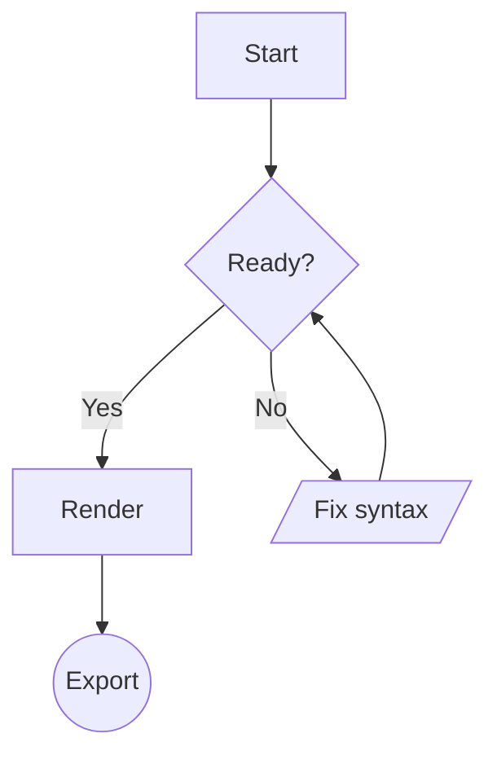
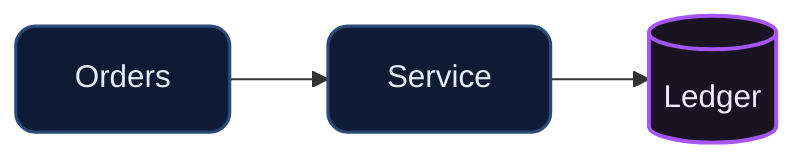
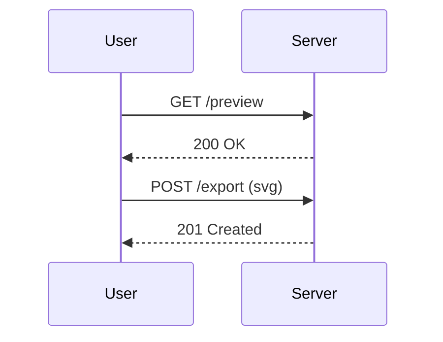
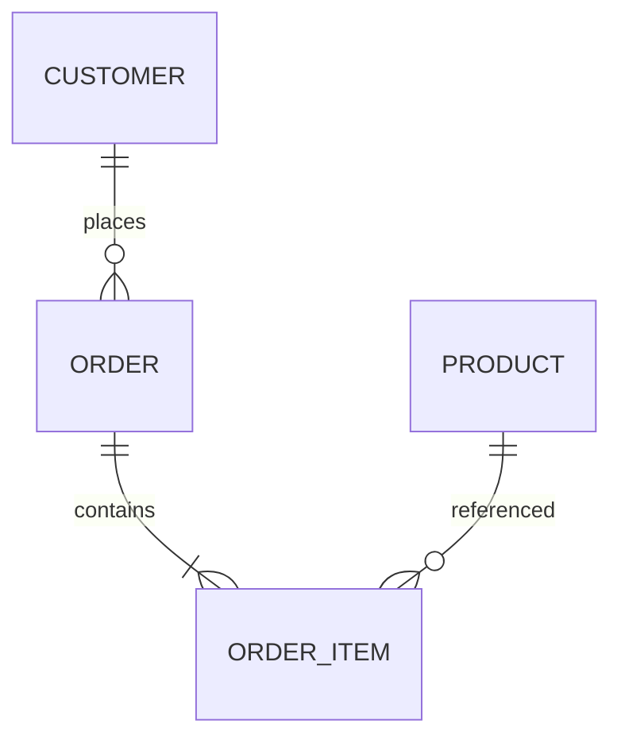
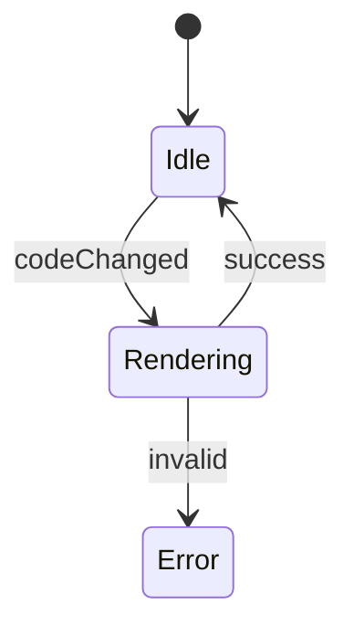

# RenderWOW

A tiny, offline-first **Mermaid renderer** with a crisp dark theme, “UE‑style” comment boxes, readable edge labels, a floating Monaco editor, and quality-of-life controls (zoom, pan, fit, export, share). Built for quickly sketching architecture, flows, and docs while keeping everything local.

[[RenderWOW screenshot](https://i.imgur.com/p21hSrN.png)

---

## Features

- 🎨 **Custom dark theme** with crisp edges, tinted subgraph “comment boxes,” and high‑contrast edge labels
- 🧭 Pan & zoom (mousewheel with Ctrl/Cmd), **Fit to screen**, **Reset**
- ✍️ **Floating Monaco editor** with collapse/expand (**Ctrl+\\**)
- 🧱 Built‑in **templates** + quick **formatter**
- 📤 Export **SVG** or **PNG**
- 🔗 **Share URLs** (`renderwow://…`) that pack your diagram code + theme mode
- 🧱 100% **offline vendors** (Mermaid, Monaco, LZ‑String) included

> Electron app: macOS / Windows / Linux. No internet required once cloned.

---

## Install & Run

```bash
# clone your repo, then:
npm install

# dev: launches Electron with hot reload
npm run dev

# produce a packaged app (platform-default)
npm run build
```

> Requires **Node.js 18+** and git. On Windows, use PowerShell or cmd.

---

## Project Layout (important bits)

```bash
public/
  index.html                # app shell (loads vendors, styles, main.js)

  assets/
    main.js                 # UI controls, pan/zoom, render, export, editor toggle
    pipeline.js             # preProcess (sanitize) + postProcess (grid + padding)
    styles.css              # active theme: crisp nodes, bright edges, chip labels
    theme-wow.css           # optional baseline theme (reference / fallback)

  vendor/
    mermaid/mermaid.min.js
    lz-string/lz-string.min.js
    monaco/**               # Monaco loader + workers (local/offline)

electron/
  main.js                   # Electron main (CSP, deep-link, save dialogs)
  preload.js                # Exposes saveSvg/savePng to the renderer

package.json
```

---

## Controls & Shortcuts

- **Render:** `Ctrl/Cmd + S`
- **Toggle Editor:** `Ctrl/Cmd + \` (or the “Hide/Show Editor” button)
- **Zoom:** `Ctrl/Cmd + Mousewheel` (or +/- in toolbar)
- **Pan:** Click+drag on the canvas
- **Fit to Screen:** `Fit`
- **Reset Pan/Zoom:** `Reset`
- **Export:** “Export SVG” or “Export PNG”
- **Share URL:** “Copy Share URL” (packs code & theme)

---

## Mermaid “Scripting” Cheatsheet (RenderWOW‑tuned)

Everything below is **plain Mermaid** (no nonstandard syntax), so it works anywhere Mermaid runs. The theme in `styles.css` makes it look great in RenderWOW.

### 1) Start a diagram



### 2) Edge styling (brighter, readable)

Use **ASCII‑safe** rgb/rgba values to avoid stray Unicode in editors.

```mermaid
flowchart TD
  %% brighter cyan lines
  linkStyle default stroke:rgb(155,224,255),stroke-width:2.2px,color:rgb(200,240,255);

  A[Client] -->|"HTTPS / fetch"| B[API]
  B -->|"JSON"| C[(DB)]
```

> `linkStyle default …` applies to all edges. You can also target specific edges with `linkStyle 1 …`, `linkStyle 2 …` using edge indices.

### 3) Node styles & classes



- `classDef` defines a reusable style.
- `:::soft` applies it to a node; you can also apply via `class A,B soft`.

### 4) Subgraphs (“UE‑style” tinted comment boxes)

You can tint each subgraph using **plain Mermaid `style <id> …`**.

```mermaid
flowchart TD
  subgraph M["Middleware"]:::group
    id1[Helmet] --> id2[CORS] --> id3[Rate limit]
  end

  %% Tint the subgraph box (id is the *first* word after `subgraph`)
  style M fill:rgba(233,196,106,.12),stroke:#e9c46a,stroke-width:1.8px,rx:18,ry:18;
```

> Tip: Use different rgba/stroke pairs to create multiple comment‑box colors.

Examples you can copy (pick one per subgraph):

```text
fill:rgba(56,189,248,.12), stroke:#38bdf8       # sky
fill:rgba(16,185,129,.12), stroke:#34d399       # emerald
fill:rgba(168,85,247,.12), stroke:#a855f7       # purple
fill:rgba(244,63,94,.12),  stroke:#f43f5e       # rose
fill:rgba(251,146,60,.12),  stroke:#fb923c      # orange
fill:rgba(99,102,241,.12),  stroke:#6366f1      # indigo
```

### 5) High‑contrast edge labels (“chips”)

The theme already styles edge labels as “chips”. Just add text on the link:

```mermaid
flowchart LR
  linkStyle default stroke:rgb(155,224,255),stroke-width:2.2px,color:rgb(200,240,255);
  A[SPA] -->|"GET /api/reports"| B[API]
```

### 6) Example: Your API map (clean, copy‑ready)

```mermaid
flowchart TD
  %% GLOBAL EDGE LOOK
  linkStyle default stroke:rgb(155,224,255),stroke-width:2.2px,color:rgb(200,240,255);

  %% CLIENTS
  A["Clerks & Admins<br/>(Browser :5173)"] -->|"HTTPS / fetch"| B["React SPA<br/>Vite + React Router + Axios"]

  %% FRONTEND -> BACKEND
  B -->|"/api/* with JWT<br/>+ refresh cookie"| C["Express API<br/>(server.js)"]

  %% MIDDLEWARE
  subgraph M["Middleware"]
    M1["Helmet CSP"] --> M2["CORS allowlist"] --> M3["Compression"] --> M4["Request ID"] --> M5["Rate limiter"] --> M6["Cookie parser"] --> M7["Auth/JWT guard"]
  end
  style M fill:rgba(233,196,106,.12),stroke:#e9c46a,stroke-width:1.8px,rx:18,ry:18;
  C --> M

  %% ROUTERS
  subgraph R["Routers (/api/*)"]
    R1["/auth/"]
    R2["/products + /categories + /modifiers/"]
    R3["/orders/"]
    R4["/payments/"]
    R5["/devices + /profiles + /staff + /time + /payroll/"]
    R6["/inventory/"]
    R7["/reports/"]
    R8["/doge/*"]
    R9["/webhooks/*"]
    R10["/rates/*"]
  end
  style R fill:rgba(56,189,248,.12),stroke:#38bdf8,stroke-width:1.8px,rx:18,ry:18;
  C --> R

  %% SERVICES
  subgraph S["Services"]
    S1["Payments Engine"]
    S2["Stripe/Coinbase<br/>Webhooks"]
    S3["DOGE Price Watcher<br/>(Coingecko)"]
    S4["DOGE Tx Watcher<br/>(walletnotify + RPC)"]
    S5["Inventory Logic"]
    S6["Ledger/Reporting<br/>Aggregations"]
  end
  style S fill:rgba(168,85,247,.12),stroke:#a855f7,stroke-width:1.8px,rx:18,ry:18;
  R4 --> S1
  R8 --> S4
  R10 --> S3
  R6 --> S5
  R7 --> S6
  R9 --> S2

  %% PROVIDERS
  subgraph P["External Providers"]
    P1["Stripe API"]
    P2["Coinbase Commerce"]
    P3["Dogecoin Core RPC<br/>127.0.0.1:18332"]
  end
  style P fill:rgba(16,185,129,.12),stroke:#34d399,stroke-width:1.8px,rx:18,ry:18;
  S1 <--> P1
  S1 <--> P2
  S4 <--> P3
  R8 <--> P3

  %% DATA
  subgraph D["MongoDB"]
    D1["Users"]
    D2["Orders"]
    D3["Payments"]
    D4["Ledger"]
    D5["Inventory: Items,<br/>Levels, Moves, Vendors,<br/>Receipts, PO, StockLedger"]
    D6["Devices/Profiles/Staff"]
    D7["DOGE Price Snapshot"]
  end
  style D fill:rgba(99,102,241,.12),stroke:#6366f1,stroke-width:1.8px,rx:18,ry:18;

  R1 --> D1
  R3 --> D2
  R4 --> D3
  S6 --> D3
  S6 --> D4
  R6 --> D5
  R5 --> D6
  S3 --> D7
  S4 --> D3

  %% DASHBOARD
  B -.->|"GET /api/reports/dashboard"| R7
  R7 -->|"aggregate"| D3
  R7 -->|"joins"| D4
```

### 7) Other diagram types (built‑ins)

RenderWOW ships with **templates** (via the “Templates…” menu). You can paste these directly too:

**Sequence Diagram**



**ER Diagram**



**State Diagram**



---

## Troubleshooting

### “Expecting 'SEMI' … got 'UNICODE_TEXT'” (or similar)
This usually means the editor injected **fancy Unicode characters** (smart quotes, en‑dash, non‑breaking spaces). Fix by:
- Using **ASCII‑only** values (e.g., `rgb(155,224,255)` instead of hex with emoji fonts)
- Re‑typing quotes `"` and `:` manually
- Running the **Format** button to strip trailing spaces

### Nothing changes after editing CSS
- The active theme is **`public/assets/styles.css`**. Make sure that’s the file you edited.
- Hard reload the window (`Ctrl/Cmd + R`) or restart the dev app.

### Diagram off screen
Click **Fit**. If you’ve panned/zoomed manually, Fit recenters to the viewport.

---

## Share URLs

Use **Copy Share URL** to put a link like `renderwow://local#t=1&c=<packed>` on your clipboard. It contains:
- `t=1|0` → dark/light
- `c=` → LZ‑String compressed diagram text

Opening that link on a machine with RenderWOW installed opens the app and loads your diagram instantly.

---

## License

MIT © You / Your Org. Mermaid is © the Mermaid authors; Monaco is © Microsoft. See upstream licenses for vendor libraries in `public/vendor/`.

---

## Credits

- [Mermaid](https://mermaid.js.org/)
- [Monaco Editor](https://microsoft.github.io/monaco-editor/)
- [LZ‑String](https://pieroxy.net/blog/pages/lz-string/)

> Have fun diagramming! If you make a cool theme tweak, PRs welcome. 🎉
